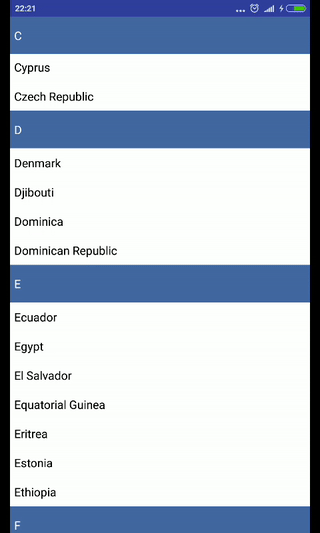

# Sticky-Header-RecyclerView

This library allows you to create lists with sticky headers in a vertical or horizontal orientation.Supports **API 10** and above.

## Usage

Create adapter and implement SHRVItemType interface.In getItemViewType function when you want to place header return TYPE_HEADER.

Adapter example:

    public class AdapterMain extends RecyclerView.Adapter<AdapterMain.ViewHolderMain> implements SHRVItemType {

    private final static int TYPE_ITEM = 1;

    ...

    @Override
    public int getItemViewType(int position) {
        if (/*Your if clause*/) {
            return TYPE_HEADER;
        } else {
            return TYPE_ITEM;
        }
    }

    ...

    }

Then instead standard layout manager use SHRVLinearLayoutManager:

    ...

    RecyclerView mRecyclerView = (RecyclerView) findViewById(R.id.recyclerView);
    mRecyclerView.setLayoutManager(new SHRVLinearLayoutManager(SHRVLinearLayoutManager.VERTICAL));
    mRecyclerView.setAdapter(new AdapterMain(this));
    
    ...

## License

Copyright 2018 Astrocode011235813

   Licensed under the Apache License, Version 2.0 (the "License");  
   you may not use this file except in compliance with the License.  
   You may obtain a copy of the License at

       http://www.apache.org/licenses/LICENSE-2.0

   Unless required by applicable law or agreed to in writing, software  
   distributed under the License is distributed on an "AS IS" BASIS,  
   WITHOUT WARRANTIES OR CONDITIONS OF ANY KIND, either express or implied.  
   See the License for the specific language governing permissions and  
   limitations under the License.